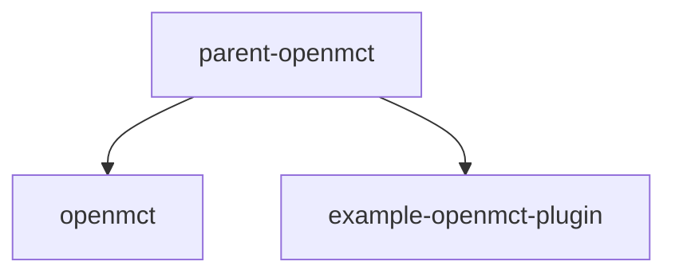

# OpenMCT as a Dependency

This repository serves as a guide for using Open MCT as a dependency in your projects. It demonstrates how to build, develop, and test Open MCT in various scenarios.

**Note:** This guide is not intended for Open MCT beginners. Newcomers should start with the [Open MCT Tutorials](https://github.com/nasa/openmct-tutorial) to learn the basics through step-by-step instructions and common use cases.

## Table of Contents

- [Getting Started](#getting-started)
- [Integration Methods](#integration-methods)
  - [Node Module Dependency](#1-node-module-dependency)
  - [Git Submodule](#2-git-submodule)
  - [Peer Dependency](#3-peer-dependency)
- [Testing](#testing)
  - [Unit Tests](#unit-tests)
  - [End-to-End (e2e) Tests](#end-to-end-e2e-tests)


## Getting Started

- **Development Guide:** For a detailed development guide, refer to [Developing Applications with Open MCT](https://github.com/nasa/openmct/blob/master/API.md#developing-applications-with-open-mct).

## Integration Methods

This project showcases three methods to integrate OpenMCT into your build process, tailored to different development requirements:

### 1. Node Module Dependency

Ideal for scenarios where you wish to use OpenMCT as-is. The [/npm-dependency](./npm-dependency) directory contains an example setup.

- **Using npm:** Source OpenMCT from [npm](https://www.npmjs.com/package/openmct) with the `@stable` npm tag:

```json
"dependencies": {
    "openmct": "stable"
}
```

- **Specifying a Version:** To use a specific version of OpenMCT, adjust the dependency as follows:

```json
"dependencies": {
    "openmct": "^2.2.5"
}
```

- **Building from Source (Not Recommended):** This approach is suitable for using recent, untested builds or specific pre-production versions:

```json
"dependencies": {
    "openmct": "nasa/openmct#master"
}
```
For a comprehensive example, see: 
- [openmct-mcws](https://github.com/NASA-AMMOS/openmct-mcws)


### 2. TODO Git Submodule

Useful for working with a specific version of OpenMCT, including forks with custom modifications. The [/git-submodule](./git-submodule) directory provides an example of this method.

### 3. TODO NPM Peer Dependency

If you are creating an openmct plugin which is designed to sit alongside openmct, you should use the peer dependency model. The [/peer-dependency](./peer-dependency) directory demonstrates this approach. For a comprehensive example, see:

- [openmct-yamcs](https://github.com/akhenry/openmct-yamcs)



## Testing

There are two primary approaches to testing when using Open MCT as a dependency: unit tests and end-to-end (e2e) tests. Before running tests, ensure to gather the `devDependencies` from the OpenMCT project with a build step:

```json
"build:example": "npm install openmct@unstable --no-save",
"build:example:master": "npm install nasa/openmct#master --no-save",
```

### Unit Tests

As of 2024, the Karma and Jasmine frameworks used for Open MCT unit tests are deprecated. 

### End-to-End (e2e) Tests

Open MCT supports an e2e test-as-a-dependency model, widely used across both open-source and proprietary projects. For an example, refer to [openmct-yamcs](https://github.com/akhenry/openmct-yamcs/blob/master/tests/README.md).
